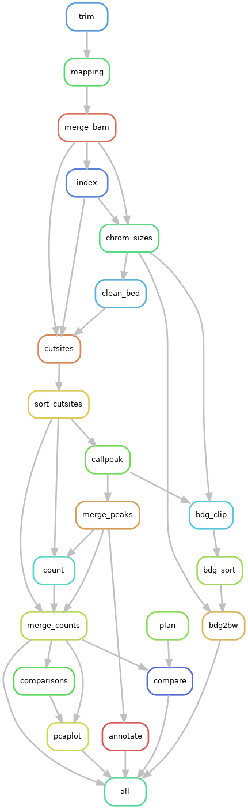

# dapipe

## 流程总览



## 依赖安装

使用conda自动安装所有依赖

```bash
conda create -n dapipe
conda activate dapipe
conda install --file environment.yaml
```

## 运行流程

首先需要创建一个本次分析的配置文件

```bash
mkdir project
cd project
cp dapipe/config.yaml .
```

浏览检查配置文件内的所有配置项（所有配置项都是必须的），并按照注释进行更改。然后运行流程

```bash
snakemake --snakefile dapipe/Snakefile -j 10 --configfile config.yaml
```

其中的`-j`是允许流程使用的最大进程数。
